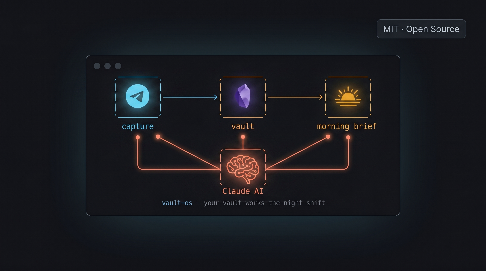

# vault-os




**An automation layer for your Obsidian vault.** Capture from anywhere, synthesize every night, wake up to a brief that actually knows what happened yesterday.

---

## The Problem

You take notes in Obsidian. You have a system. But at 11 PM, nothing connects on its own — yesterday's half-finished action item is buried, your Telegram idea never made it to the right place, and tomorrow's focus is a blank page.

vault-os runs while you sleep. It reads your inbox, checks your git repos, synthesizes your captures, carries over unfinished work, and writes tomorrow's morning brief — all automatically. Every night, at 23:00.

---

## What vault-os Adds

| | What you get |
|--|--|
| 📩 **Telegram capture** | Send a message, voice note, or URL from your phone — it lands in the right section of today's daily note, tagged and timestamped |
| 🎙️ **Local voice transcription** | Voice messages transcribed by [whisper.cpp](https://github.com/ggerganov/whisper.cpp) on your machine — no audio ever leaves your network |
| 🤖 **12-phase nightly agent** | Runs at 23:00 via Task Scheduler: syncs inbox, calls Claude, writes tomorrow's brief, archives processed files, lints wiki, runs weekly pattern analysis |
| ☀️ **Morning digest API** | One endpoint returns your daily brief + yesterday's evening synthesis + wiki hot context — ready for a dashboard or phone widget |
| ✍️ **ContentPipeline feed** | The "Content Angle" from each evening review is auto-copied into your content pipeline inbox |
| 🧠 **Decision intelligence** | Pre-decision endpoint draws on your full decision archive and business-edge notes before you commit to anything |

---

## How It Works

```
  Your phone
      │
      │  Telegram message / voice note
      ▼
  server.js  ──────────────────────────────────────────────────────┐
  (port 3777)                                                       │
      │  tag routing (#idea / #signal / #link / plain / voice)      │
      ▼                                                             │
  50_DAILY/YYYY-MM-DD-morning.md                                   │
  ├── ## Captures                                                   │
  ├── ## Content Ideas                                              │
  ├── ## Research Signals                                           │
  └── ## Links to Process                                           │
                                                                    │
  ──────────────── 23:00 every night ────────────────────────────  │
                                                                    │
  nightly-agent.ps1                                                 │
  ├── FAZ 1  Observe      ← reads 00_INBOX/, git status            │
  ├── FAZ 2  Vault Sync   ← updates project overview pages         │
  ├── FAZ 3  Think        ← Claude: risks, connections, priorities  │
  ├── FAZ 4  Learn        ← appends to MEMORY/LEARNING             │
  ├── FAZ 5  Wiki Update  ← refreshes wiki/hot.md                  │
  ├── FAZ 6  Morning Brief← writes tomorrow's daily note + carry-over
  ├── FAZ 7  Verify       ← checks all outputs exist               │
  ├── FAZ 8  Archive      ← moves INBOX → 70_ARCHIVE/YYYY/MM/      │
  ├── FAZ 9  Patterns     ← Sunday: decision pattern analysis       │
  ├── FAZ 10 Connect Tour ← Sunday: Claude finds new wiki links     │
  ├── FAZ 11 Evening Review← synthesizes today's captures          │
  └── FAZ 12 Wiki Lint    ← Sunday: broken links, orphan, stale    │
                                                                    │
  Dashboard (browser)  ◄───────────────────────────────────────────┘
  http://localhost:3777
  ├── Morning digest panel
  ├── Project git status
  ├── Service health
  ├── Vault stats
  └── JARVIS AI chat
```

---

## Table of Contents

- [Prerequisites](#prerequisites)
- [Quick Start](#quick-start)
- [Configuration Reference](#configuration-reference)
- [Nightly Agent — 12 Phases](#nightly-agent--12-phases)
- [Telegram Bot](#telegram-bot)
- [Dashboard API Endpoints](#dashboard-api-endpoints)
- [Vault Folder Structure](#vault-folder-structure)
- [Using with Claude Code](#using-with-claude-code)
- [Windows-Only Notice](#windows-only-notice)
- [Contributing](#contributing)
- [License](#license)

---

## Prerequisites

| Requirement | Version | Install |
|-------------|---------|---------|
| Node.js | 18+ | [nodejs.org](https://nodejs.org) |
| PowerShell | 7+ | [github.com/PowerShell](https://github.com/PowerShell/PowerShell) |
| Obsidian | any | [obsidian.md](https://obsidian.md) — your vault must exist before first run |
| Claude CLI | latest | `npm install -g @anthropic-ai/claude-code` |
| ffmpeg | any | [ffmpeg.org](https://ffmpeg.org) — must be on PATH; required for voice transcription |
| whisper.cpp binary | any | [Releases](https://github.com/ggerganov/whisper.cpp/releases) — optional; enables local voice transcription |

> **Windows only.** The nightly agent uses `wmic` and Windows Task Scheduler. The dashboard server is cross-platform, but the full automation stack requires Windows.

---

## Quick Start

**1. Clone and install**

```bash
git clone https://github.com/sabahattink/vault-os.git
cd vault-os
./setup.sh
```

**2. Configure**

```bash
# .env was created by setup.sh
# Minimum required: VAULT_PATH, TELEGRAM_BOT_TOKEN, ANTHROPIC_API_KEY
notepad .env
```

**3. Fill in CLAUDE.md**

```bash
cp CLAUDE.md.template CLAUDE.md
# Edit: YOUR_NAME, VAULT_PATH, your projects and org context
```

**4. Start the dashboard**

```bash
cd dashboard
node server.js
# Open http://localhost:3777
```

**5. Register the nightly agent** *(optional — run once as Administrator)*

```powershell
pwsh -File scripts/install-scheduler.ps1
# Agent runs automatically at 23:00 every night
```

Manual trigger at any time:

```powershell
pwsh -File scripts/nightly-agent.ps1 -VaultPath "C:\your\vault\path"
```

---

## Configuration Reference

Copy `.env.example` to `.env` and set your values. The dashboard loads `.env` on startup. The nightly agent reads from system environment — set variables in your PowerShell profile or pass via `$env:VAR = "value"`.

| Variable | Required | Default | Description |
|----------|----------|---------|-------------|
| `VAULT_PATH` | ✅ | — | Absolute path to your Obsidian vault root |
| `TELEGRAM_BOT_TOKEN` | ✅ | — | Bot token from [@BotFather](https://t.me/BotFather) |
| `ANTHROPIC_API_KEY` | ✅ | — | API key from [console.anthropic.com](https://console.anthropic.com) |
| `CONTENT_PIPELINE_DIR` | ✅ | — | Path to your ContentPipeline directory |
| `PORT` | No | `3777` | Dashboard server port |
| `WHISPER_CLI` | No | — | Full path to `whisper-cli.exe` — omit to disable voice |
| `WHISPER_MODEL` | No | `ggml-small.bin` | Model filename (in `models/` next to the binary) |
| `WHISPER_LANG` | No | `en` | Transcription language code (`tr`, `de`, `fr`, …) |
| `NOTION_TOKEN` | No | — | Notion integration token for inbox sync |
| `DATA_SCAN_PATHS` | No | — | Semicolon-separated paths to scan into INBOX |
| `VPS_IP` | No | — | Server IP shown in the dashboard sidebar |
| `MONITORED_SERVICES` | No | — | `Name\|URL` pairs, comma-separated, for uptime monitoring |
| `N8N_URL` | No | `http://localhost:5678` | n8n URL for status check |
| `DB1_PORT` – `DB3_PORT` | No | `5432–5434` | TCP ports checked in the MCP status panel |

---

## Nightly Agent — 12 Phases

Runs every night at 23:00, completes in roughly 2–5 minutes depending on inbox size and Claude response time.

| Phase | Name | What it does |
|-------|------|-------------|
| 1 | **Observe** | Runs Notion sync + disk sync; reads all files in `00_INBOX/`; collects git status for every project |
| 2 | **Vault Sync** | Creates or updates `20_PROJECTS/<id>/<id> Overview.md` and `wiki/entities/<id>.md` for each project |
| 3 | **Think** | Sends inbox summary + git statuses to Claude; receives JSON with critical items, connections, risks, opportunities, priorities |
| 4 | **Learn** | Appends today's learnings to `MEMORY/LEARNING/learnings.md` |
| 5 | **Wiki Update** | Prepends fresh project status table + open blockers + pipeline counts to `wiki/hot.md`; appends to `wiki/log.md` |
| 6 | **Morning Brief** | Writes tomorrow's daily note with morning brief; extracts uncompleted `- [ ]` items from today → `## Carry-over`; appends empty capture scaffold |
| 7 | **Verify** | Checks all expected output files were written; logs WARN for any missing |
| 8 | **Archive** | Moves all processed `00_INBOX/` files to `70_ARCHIVE/YYYY/MM/` |
| 9 | **Pattern Analysis** | *Sundays:* reads decision archive → Claude writes weekly pattern report to `60_ACTIONS/patterns/`; updates `BUSINESS-EDGE.md` |
| 10 | **Connect Tour** | *Sundays:* reads wiki skill files + sample pages → Claude discovers cross-domain connections not yet wikilinked |
| 11 | **Evening Review** | Reads today's four capture sections → Claude produces BEST CAPTURE · CONTENT ANGLE · CONNECTIONS · TOMORROW FOCUS; appends as `## Evening Review`; copies CONTENT ANGLE to ContentPipeline inbox |
| 12 | **Wiki Lint** | *Sundays:* scans all vault `.md` files for broken wikilinks, orphan wiki pages, and stale notes (>90 days); writes `wiki/lint-log-YYYY-MM-DD.md` |

---

## Telegram Bot

Start the dashboard server with `TELEGRAM_BOT_TOKEN` set — the bot activates automatically.

### Tag routing

| Message format | Target section |
|----------------|---------------|
| Plain text | `## Captures` |
| `#idea <text>` or `#fikir <text>` | `## Content Ideas` |
| `#signal <text>` or `#research <text>` | `## Research Signals` |
| `#link <text>` or bare URL | `## Links to Process` |
| Voice message | Transcribed → routed by detected tags in transcript |

Multi-line messages are supported — each line is routed independently.

The bot replies with a confirmation showing exactly which sections received entries and which daily note file was updated.

### Voice transcription

Requires `WHISPER_CLI` set to a [whisper.cpp release binary](https://github.com/ggerganov/whisper.cpp/releases), a downloaded model, and `ffmpeg` on PATH. The pipeline is:

```
OGG (Telegram) → ffmpeg → 16kHz mono WAV → whisper-cli → text → route → daily note (🎤 prefix)
```

Recommended model: `ggml-small.bin` (466 MB) — good accuracy across English and other languages. For English only, `ggml-base.en.bin` (142 MB) works well.

---

## Dashboard API Endpoints

The dashboard server exposes a REST API and a WebSocket on the same port.

| Method | Endpoint | Description |
|--------|----------|-------------|
| GET | `/health` | Server liveness check |
| GET | `/api/morning-digest` | Today's brief (6 sections) + yesterday's evening review + wiki hot snippet |
| GET | `/api/morning` | Today's daily note as HTML |
| GET | `/api/stats` | Note counts per vault folder |
| GET | `/api/actions` | Pending and completed action items |
| POST | `/api/action-toggle` | Toggle a checkbox in `60_ACTIONS/actions.md` |
| POST | `/api/quick-capture` | Write a note directly to `00_INBOX/` |
| GET | `/api/pipeline` | ContentPipeline stage counts |
| GET | `/api/pipeline-files/:stage` | File list for a pipeline stage |
| GET | `/api/social` | Content items grouped by platform and stage |
| GET | `/api/projects` | Project list with file counts |
| GET | `/api/ops/projects` | Projects with live git status |
| GET | `/api/ops/github` | Recent repos via `gh` CLI |
| GET | `/api/ops/n8n` | n8n reachability check |
| GET | `/api/vps` | Uptime check for `MONITORED_SERVICES` |
| GET | `/api/sysload` | CPU and memory usage *(Windows only — uses `wmic`)* |
| GET | `/api/intel/alerts` | Consolidated health alerts |
| GET | `/api/intel/ai-brief` | Claude-generated daily priority brief (1-hour cache) |
| GET | `/api/brain-data` | Hot nodes from `wiki/hot.md` + MEMORY file list |
| GET | `/api/search?q=` | Filename search across inbox, notes, actions, wiki, pipeline |
| GET | `/api/opportunities` | Items from `60_ACTIONS/product-opportunities.md` |
| GET | `/api/decisions/count` | Decision archive stats |
| POST | `/api/decisions/save` | Save a new decision record |
| POST | `/api/pre-decision` | Claude-generated pre-decision brief from decision history |
| POST | `/api/ask` | JARVIS AI chat with full vault context |
| GET | `/api/system` | Last nightly agent log entry |

**WebSocket** on the same port: pushes `vault_change` events (file watch via chokidar) and `ping` every 30 seconds.

---

## Vault Folder Structure

vault-os expects (and gradually builds) this folder layout inside your Obsidian vault:

```
VAULT_PATH/
├── 00_INBOX/            → nightly agent entry point; all incoming files land here
├── 10_NOTES/            → atomic notes
├── 20_PROJECTS/         → project hub pages (auto-created by FAZ 2)
├── 50_DAILY/            → YYYY-MM-DD-morning.md (brief + capture sections)
├── 60_ACTIONS/
│   ├── actions.md       → master action list
│   ├── decisions/       → decision records (YYYY-MM-DD-topic.md)
│   ├── patterns/        → weekly pattern reports
│   └── BUSINESS-EDGE.md → known strengths and weaknesses
├── 70_ARCHIVE/          → processed inbox files (YYYY/MM/)
├── wiki/
│   ├── hot.md           → always-fresh context (updated every night)
│   ├── index.md         → vault map
│   ├── log.md           → nightly agent history
│   ├── entities/        → per-project/person entity pages
│   └── skills/          → ingest · connect · synthesize rule files
└── MEMORY/
    ├── WORK/
    ├── KNOWLEDGE/
    └── LEARNING/
```

The nightly agent creates missing directories on first run. You do not need to set all of this up manually — start with an empty vault and let the agent build the structure.

---

## Using with Claude Code

vault-os ships a `CLAUDE.md.template` that gives Claude Code full context about your vault structure, commands, and automation behavior. Copy it and fill in your details before opening the project in Claude Code.

```bash
cp CLAUDE.md.template CLAUDE.md
# Edit: YOUR_NAME, VAULT_PATH, your organization and active project context
claude    # Claude Code reads CLAUDE.md automatically on startup
```

---

## Windows-Only Notice

The following components require Windows:

- **`/api/sysload`** — uses `wmic cpu get loadpercentage` and `wmic OS get FreePhysicalMemory`
- **`install-scheduler.ps1`** — registers a Windows Task Scheduler job
- **`nightly-agent.ps1`** — written for PowerShell 7 on Windows

The dashboard server (`server.js`) and the Telegram bot are cross-platform. Only the `wmic` endpoint and Task Scheduler integration are Windows-specific. Linux/macOS users can run the dashboard and trigger the nightly agent manually.

---

## Contributing

See [CONTRIBUTING.md](CONTRIBUTING.md) for development setup, code style, and the PR process.

---

## License

MIT — see [LICENSE](LICENSE)
